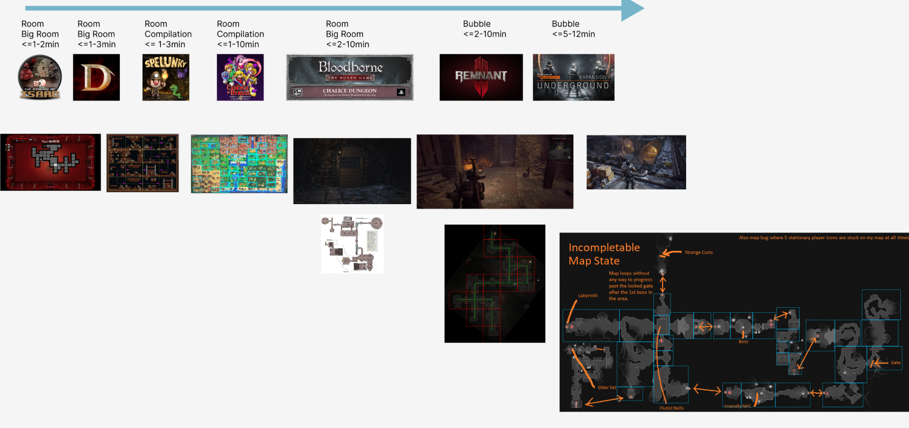
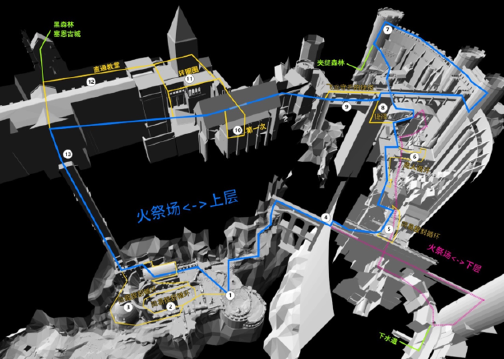
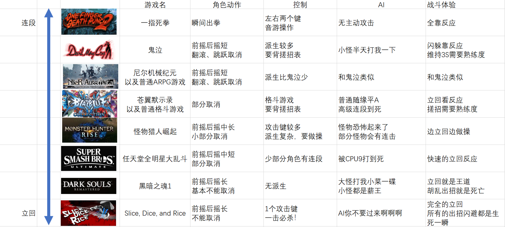

## 关卡是编排惊喜-魂1

- 关卡里重要的是**惊喜**/**惊吓**的密度, 配合空间和布怪实现
- 在探索时保持紧张, 发现新事物的期待感, 达成跌宕起伏, 不带停止的心流
- 魂1的高级惊喜是**空间魔术**感
- "这里竟然有口子的, 刚经过的时候没发现"
- "竟然绕回了这里"
- "竟然是连在一起的"
- "这里下面竟然是这!"
- 法环DLC的高低差也很有这个感觉, 要是能利用高低差迅速移动就好了
- 连通性的意义不如上面两个, 纯粹只是上面的结果, **不要把连通性当作设计目的**,  只是一种引导空间设计的方式

 