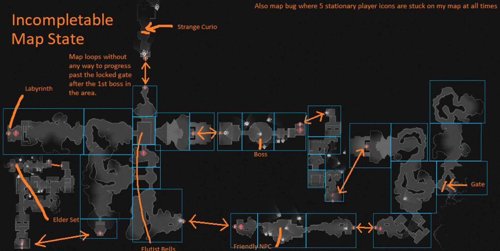
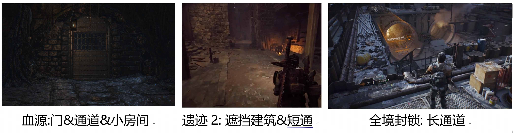
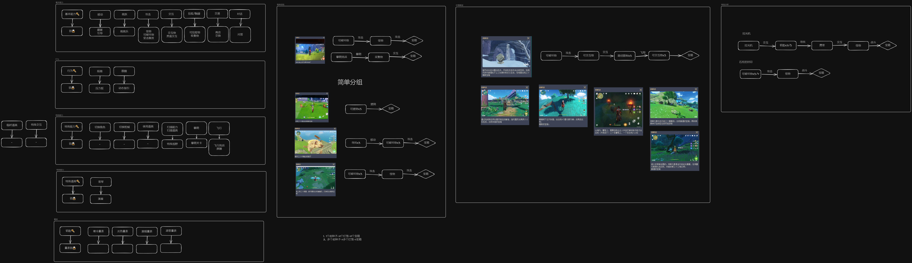

### Dependency Graph

[PCG - Spelunky Level Generation - release date, videos, screenshots, reviews on RAWG](https://rawg.io/games/pcg-spelunky-level-generation)

[How I make a dependency graph | Patreon](https://www.patreon.com/posts/how-i-make-graph-20631617)

[Spelunky by Derek Yu – Boss Fight Books](https://bossfightbooks.com/products/spelunky-by-derek-yu)

### PCG导论

[Procedural Content Generation in Games | Request PDF (researchgate.net)](https://www.researchgate.net/publication/309280537_Procedural_Content_Generation_in_Games)

[(PDF) Constructive generation methods for dungeons and levels (researchgate.net)](https://www.researchgate.net/publication/309279824_Constructive_generation_methods_for_dungeons_and_levels)

# 算法要素

1. 一个表达地牢的模型
2. 生成该模型的算法
3. 针对模型生成对应表现的算法

# 算法步骤

1. 空间分区

    1. Agent-Based methods 模拟探索算法, 往地里打洞
    2. Cellular automata 元胞自动机, 生成结构, 方便生成洞穴
    3. Generative Grammar 生成语法, 可以兼容

生成语法

# Enter the Gungeon

- 地图说明

  - "E" : 开始
  - 蓝色箱子/黄方框箱子: 宝箱
  - 头: 商店老板
  - 黄骷髅: Boss
  - 绿六点: 传送器
  - 红线: 从上a单行通道
- 好处

  - 起始点和Boss的距离合适
  - 奖励前面可以加房间, 并且可以做单向回环

地图Layout:
https://boristhebrave.com/content/2019/07/gungeon_flows.zip
[GungeonMapping_Rev1.1_Eng.pdf - Google 云端硬盘](https://drive.google.com/file/d/1NMAKiJlCoooQzqXneosSSOAuTvSE_SlM/view)

- 地图生成时还会往Flow里注入一些房间
- 子树会先进行聚合
- 位置贴不上的, 则贴一个通道房间
- 然后会生成敌人和物品

# Spelunky

游戏分为

1. 4个区域: 矿山, 丛林, 冰洞, 寺庙
2. 每个区域4个关卡, 16个关卡
3. 每个关卡包括16个房间

    1. 规范

        1. 从顶部入口开始, 从底部出口开始
        2. 必须有一条不使用炸弹, 绳索, 特殊物品的情况从入口到达出口
        3. 关卡生成的时候不能把玩家卡死 (玩家可以把自己卡死)
        4. 让房间的边缘难以察觉
    2. 生成: Agent探索的方式, 随机从顶部到底部左右下走, 生成一条路径

        1. 0: 没走过的房间
        2. 1: 左右两侧有开口的房间
        3. 2: 底部有开口的房间
        4. 3: 左右两侧, 底部都有开口
        5. 如果两个2在垂直方向叠着, 下面的2的顶部也会有开口
4. 每个房间从模板中抽取, 模板有 basic room, low ceiling, ladders, upper platforms, treasure below, 模板是10*8的字符

    1. 0: 空气
    2. 1: 墙
    3. L: 梯子
    4. P: 有平台的梯子
    5. 4: 石头, 可以水平推动
    6. 2: 50%的几率是墙, 50%的几率是空气
    7. 6: 代表一个5*3的chunk, 从10个模板中抽取
5. chunk: 多方块结构
6. entity: 按概率动态内容生成, 概率由手调得来

    1. 左边例子是丛林的地面上的概率, 保证陷阱/穴居人正常概率, 青蛙要比较多
    2. 各种物体生成

        1. 宝藏: 物品箱, 宝箱, 宝石, 黄金等, 生成在"壁龛"中(alcoves), 三面靠墙
        2. 怪物: 概率生成
        3. 陷阱:

[yancharkin/SpelunkyClassicHD: A modified version of Derek Yu&apos;s game Spelunky Classic. (github.com)](https://github.com/yancharkin/SpelunkyClassicHD)

# 血源诅咒

[Chalice Dungeons Rooms | Bloodborne Wiki (bloodborne-wiki.com)](https://www.bloodborne-wiki.com/2022/10/chalice-dungeons-rooms.html)

[The Tomb Prospectors Discoveries | Bloodborne Wiki (bloodborne-wiki.com)](https://www.bloodborne-wiki.com/p/the-tomb-prospectors-discoveries.html)

- 提前固定的布局, 每个深度4, 5的地牢有200个布局, 每个深度1, 2, 3 的地牢有100个布局
- 布局会分组, 每一组布局会和特定的物体绑定, 获取特定物体后, 这一组地牢将不会随机到
- 当所有物品都获取到之后, 会重新开发所有的随机布局设定

#### 生成过程

- 本地会生成一个地牢, 没有地牢保有一个Glyph (ID), 可以选择共享到服务器-
- 服务器会每两周清理一次无人访问的Glyph
- 然后会从不同深度的地牢抽取一个地图模板

布局抽取

- Dungeon ID

  - Area and Depth: 地区和深度, 会决定宝石概率
  - Layout Seed:  从100/200个预设布局中挑, 分为 普通Dungeon Map 和 Map Defiled 和 Map Sinister
  - 布局本质上是缝起来的房间, 每个房间会有一些固定的出生点, 用于特殊的敌人/商店NPC
- Dungeon Effects: 一些随机效果

  - Special Enemy/Shop: 会有以下6种情况, 几率根据Area不同而不同

    - 无特殊情况
    - 生成信使
    - 生成帕奇蜘蛛
    - 生成兽化者
    - 信使+兽化者
    - 帕奇蜘蛛+兽化者
  - Unique Item: 生成特殊奖励物品, 和抽取分组时一个东西
  - Gem Effect: 提升宝石稀有程度, 增加魂量, 怪物伤害/防御
  - 4th Layer: 20% 几率开放4层
  - Poison: 20%几率在深度4, 5有毒, 水->毒水, 瓮->毒烟瓮, 敌人站在毒水上会带毒

Layout会分为Group, 每个Group和特定的物品有关
右图来自Isz Glitch, 最后标记?的两个组, 可能有已经移除的物品, 角色的生成会卡在这里

- 地区: 苏美鲁
- 深度: 1-5
- 层数: 4层, 大多数都是4层, 但是第4层的门会被封上, 只会显示3层
- 锁: 一个拉杆, 一扇门
- 地图结构: Pre-Lamp, Main Area, Pre-Boss, Boss Arena

  - Pre-Lamp: 摸灯前的通道, 可能会有侧门或者侧青铜门, 可能会有棺材
  - Main Area: 灯之后的区域, 总附近会有一个上锁的门, 会有一个拉杆
  - Pre-Boss: 上锁门之后的区域, 可能会有侧门棺材

**仪式(Rites)**
每个地牢最多4个, 可以任意组合一下4种Rite

- Sinister Bell Rite:

  - 每一层添加一个敲钟人, 允许两名玩家同时入侵, 只要敲钟人还在, 入侵者就可以进入这一层, 主要用来PVP
  - 多个Sinister仪式不会发生什么
- Fetid Offering Rite:

  - 给一些敌人上红色光环, 伤害增加35%, 这些敌人的奖励变多
  - 多个恶臭仪式会导致一些生成错误, 同时生成多个怪物, 有多个武器, 纹理问题, AI问题, 命中框缺失
- Rotted Offering Rite:

  - 会替换一些原有怪物为NPC猎人, Eye Collectors, Labyrinth Ritekeepers
  - 多个腐烂仪式会生成 NPC, **BPS?** , 仪式守护者(RiteKeepers), Hemwick 女巫, Mensis Puppets 傀儡
- Curse Rite:

  - 每一个诅咒仪式会让 HP减半, 会让敌人掉落被诅咒的宝石, 奖励升高
  - 提高有Eye或者Milkweek符文的物品掉落率
  - 四个则只会有8分之一的生命值

# 门

- 普通实心门 (Common solid door)

  - 后面是拉杆或者棺材
- 普通格栅门 (Common grated door)

  - 后面时侧路或者死胡同
- 单向门 (One way door)

  - 通常是生成捷径
  - 也会用于连接房(Connecting room)
- 主区域门 (Main area door)

  - 只会在灯房 (Lamp room) 之前找到
- 杠杆门 (Lever operated door)

  - 分隔主区域和Boos房
  - 有时候可以绕过杠杆门, 从后面打开
- 奖励区域门 (Bonus area door)

  - 灯前区和主区域都可能会有的奖励区域
- 藏宝室门 (Treasure room door)

  - 专用藏宝室的门, 里面有一大堆宝箱
- Bug门 (Glitched bronze door)

  - 有时候会有生成问题, 奖励门替代了普通门

# 标准房 Standard room

- 房间大小, 门口, 阳台的位置可能会不同
- 可以通过一个巨大的门口和双楼梯房间相连
- 通常有一座桥会连接两个阳台, 偶尔会有两座桥
- 会刷出压力板陷阱
- 阳台上会出现隐形门
-

### 其他游戏

[Dungeon Generation in Enter The Gungeon – BorisTheBrave.Com](https://www.boristhebrave.com/2019/07/28/dungeon-generation-in-enter-the-gungeon/)

[BorisTheBrave.Com](https://www.boristhebrave.com/)

[Search Results for “generat” – BorisTheBrave.Com](https://www.boristhebrave.com/?s=generat)

[GitHub - mxgmn/MarkovJunior: Probabilistic language based on pattern matching and constraint propagation, 153 examples](https://github.com/mxgmn/MarkovJunior/tree/main)

[Tile-Based Map Generation using Wave Function Collapse in &apos;Caves of Qud&apos;](https://www.youtube.com/watch?v=AdCgi9E90jw&t=62s)

[Dungeon Generation in Enter The Gungeon – BorisTheBrave.Com](https://www.boristhebrave.com/2019/07/28/dungeon-generation-in-enter-the-gungeon/)

[End-to-End Procedural Generation in Caves of Qud (youtube.com)](https://www.youtube.com/watch?v=jV-DZqdKlnE&t=357s&ab_channel=GDC)

#### 原神解谜分析

