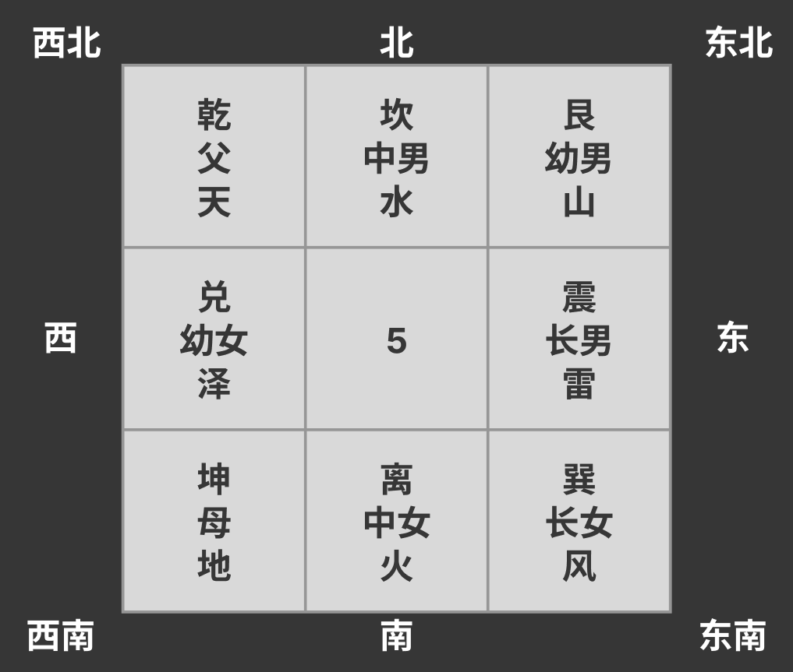
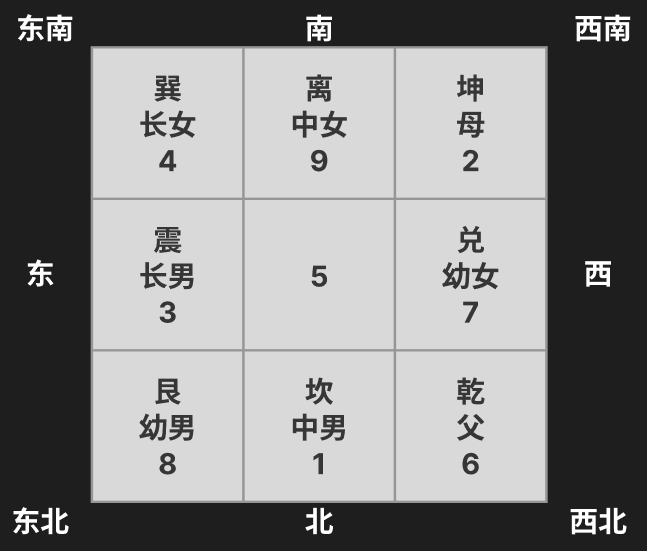
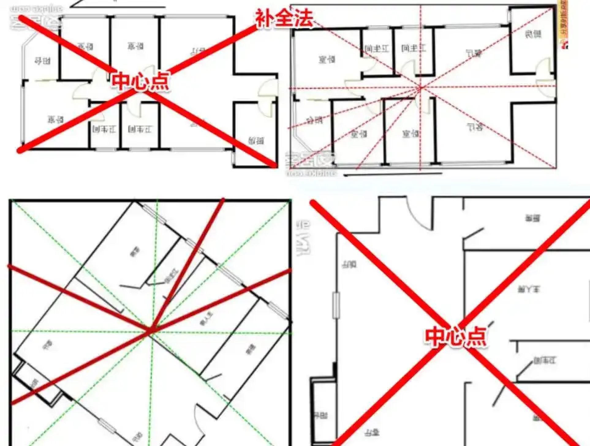
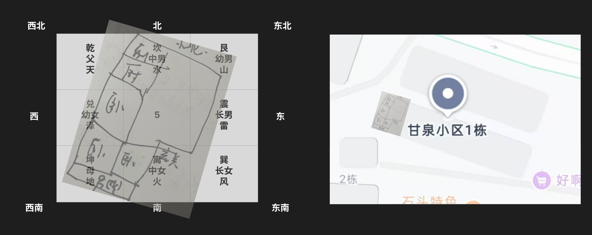

|     | 方位 |     | 象  | 长幼 | 解字                                                                                                                                                                                                |
| --- | ---- | --- | --- | ---- | --------------------------------------------------------------------------------------------------------------------------------------------------------------------------------------------------- |
| 乾  | 西北 |     | 天  | 父   | 阳刚的，男性的，（太阳发光，草升），乾道成男，坤道成女                                                                                                                                              |
| 坤  | 西南 |     | 地  | 母   | 阴，（阴阳学里申为阳，土里的阳，为阴）女性的，坤卦象女德之仪                                                                                                                                        |
| 震  | 东   |     | 雷  | 长男 | （象形，雨下的闪电形状）恐惧，惊惧，震惊百里，惊远而惧迩也                                                                                                                                          |
| 巽  | 东南 |     | 风  | 长女 | （通顺），消散，卑顺，谦恭                                                                                                                                                                          |
| 离  | 南   |     | 火  | 次女 | 離, 火/日/电，（离：山神/猛兽，头冠，凶（地交陷），兽足蹂地。右半为雀，鸟的总名。離黄，仓庚，指黄鹂鸟，鸣则虫生。）（麗，一对玉，头角身形下四足，为鹿，附着之意）燃烧/光照/电为依附于他物而彰显自身 |
| 坎  | 北   |     | 水  | 次男 | 陷（人陷在土里，头上冒气)                                                                                                                                                                           |
| 艮  | 东北 |     | 山  | 幼男 | 静止（目匕，目光像匕首一样相对，不相上下）                                                                                                                                                          |
| 兑  | 西   |     | 泽  | 幼女 | （山间有口，人陷在里面）                                                                                                                                                                            |

#### 阳宅原理

风水: 山川河流, 阴宅. 地理: 阳宅

长幼有序，名位相等
天地有八方，象征四维八德，天地养育众生，父母养育家庭是一样的
天地分为九宫八卦，家的象也是九宫八卦，家的象和自然界的神就一样了
同时间出生的人很多，住的位置不同，念和想法就不同
位置决定念，念决定做法，做法直接影响结果，位置改对就念就对

算命只是工具，阳宅地理是运，运是掌握在自己手上的

##### 念

叛逆：子居父位，父居子位，形上还是爸爸儿子，神上已经互换了，就不会听爸爸话
子居父位，即震上乾下，雷天大壮，过之谓之狂者，20岁念是40岁，我是爸爸，谁的话都不会听，责任感很强
父居子位，天雷无妄，无妄之灾
性转：大儿子住三女儿位置，震上兑下，雷泽归妹
先婚：三女儿住大女儿位置
父居母位：辅佐之相，天居地位，天地否卦，否塞不同，先生倒霉，所以男人婚前要一个位置，婚后一个位置，老大结婚后老二老三递补

##### 象

**厨房**: 象为**刀**
有些夫妻太太先过世，厨房在西南，儿子夭折，厨房在东宫
一刀两断，厨房在东，未育的夫妻就生双胞胎，若中心点在正东南巽位，就是女双胞胎，如果跨越正东和东南，就是龙凤胎，如果罗经看切菜刀偏东，儿子先出来

**客厅**，象为**客**
东边是客厅，地理上没儿子，如果八字里没儿子，就会100%没儿子
东边是客厅，儿子来去自如，比如会寄宿，来来回回
西北是客厅，爸爸变客人，把外面当家，或者打拼很辛苦，回来睡觉又走

**厕所**：**污秽**, 空气不好，呼吸系统不好
厕所在东宫，长子呼吸
厕所在西北，污浊代表官司纠纷，粪和黄金同象，会冲掉，爸爸破财，所以厕所要放到无人带

**北为阳, 南为阴**

结婚后住南边皆生女，住北边生儿子，南边阴，北边阳
床压到东边墙壁，会负负得正，本来生女儿，会生儿子

#### 户型

不管带
罗经360°有24个分金煞，一个宫只占15°，8个房间之外还有16个宫是不管带

### 阳宅记录

